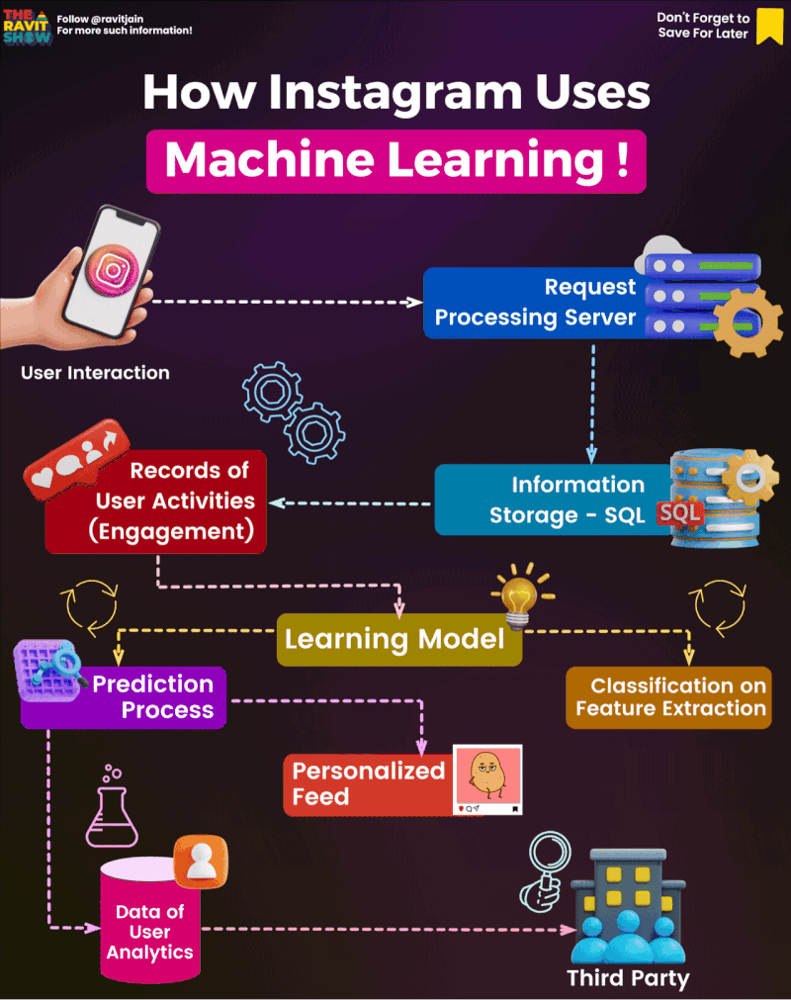

🌟 Hit star button to save this repo in your profile

# Case study:Unveiling Instagram's Engagement Magic through Machine Learning 🤖

Instagram, a leading social media platform, harnesses the power of machine learning to create a highly personalized user experience. Machine learning plays a pivotal role in tracking and understanding user interactions, allowing Instagram to craft detailed user profiles and categorize interests. Using this wealth of data, Instagram predicts the type of content users are likely to engage with and curates their feeds accordingly, ensuring that posts are not just chronological but highly relevant. Machine learning also drives content recommendations, powers the "Explore" section, and targets advertisements, enhancing both user engagement and ad effectiveness. Moreover, it aids in user safety by detecting and removing inappropriate content, and even facilitates real-time notifications. Instagram's use of machine learning is a dynamic and integral part of delivering a tailored and captivating social media experience. 

Ever wondered how Instagram keeps you captivated and glued to your feed? Let's delve into the enchanting world of Instagram's machine learning. Here's the spellbinding process:

## 🔍 **Tracking our Interactions**

Instagram is a silent observer, meticulously **tracking every like, comment, and share** you make. This treasure trove of interactions helps Instagram understand your preferences, from the latest fashion trends to your favorite travel destinations. Each interaction provides valuable insights into your interests, enabling Instagram to create a comprehensive profile of your digital persona.

## 🗄️ **Storing our Data**

All your interactions and more are safely **stored in Instagram's colossal databases**. This data repository ensures swift and seamless access to your digital footprint, even as it continues to grow. The vast databases serve as the reservoir of your digital history, making it readily available for analysis and prediction.

## 📊 **Analyzing our Data**

Instagram's wizardry comes to life with the power of **machine learning**. This intricate spellbook allows Instagram to analyze your data and discern patterns. For instance, if your heart skips a beat for feline friends and you can't resist double-tapping cat photos, Instagram takes note. It knows you're enchanted by cats. Machine learning algorithms process this data, uncovering hidden connections and building a nuanced understanding of your preferences.

## 🔮 **Predicting what we Like**

Machine learning doesn't stop at patterns; it's also about **predicting your desires**. If you're a fan of both cats and dogs in the Instagram universe, it's no secret that videos of playful cats and adorable dogs might tickle your fancy. Instagram's crystal ball of algorithms makes these predictions. By analyzing your past interactions and comparing them with a vast pool of data from other users, Instagram's machine learning models can make educated guesses about the content that's likely to capture your attention.

## 🎁 **Showing us what we Like**

The climax of this magic show is Instagram **curating your personalized feed**. With your predicted preferences in mind, it conjures up a stream of content that's tailored to your tastes. This means you're more likely to encounter posts and stories that pique your interest, keeping you scrolling and enchanted. Instagram's ultimate goal is to make your social media experience as captivating and enjoyable as possible by delivering a feed that resonates with your unique preferences.

Instagram's machine learning isn't just data science; it's a bewitching experience that ensures your social media journey is as captivating as it can be! ✨📱👁️‍🗨️

## Contribution 🛠️
Please create an [Issue](https://github.com/drshahizan/BDM/issues) for any improvements, suggestions or errors in the content.

You can also contact me using [Linkedin](https://www.linkedin.com/in/drshahizan/) for any other queries or feedback.

