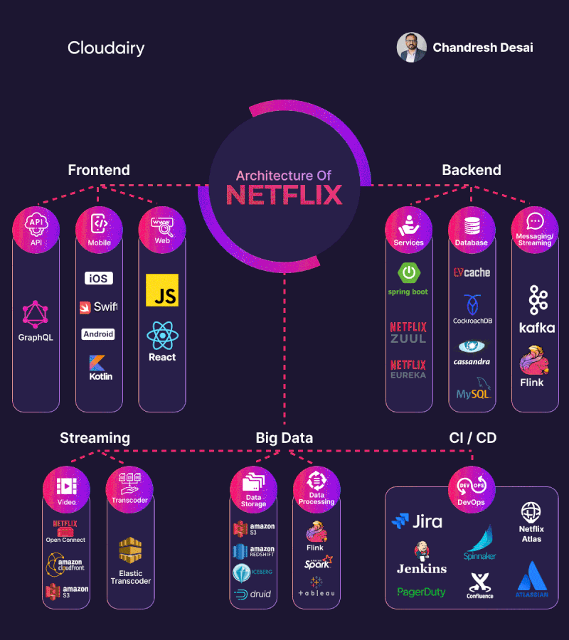
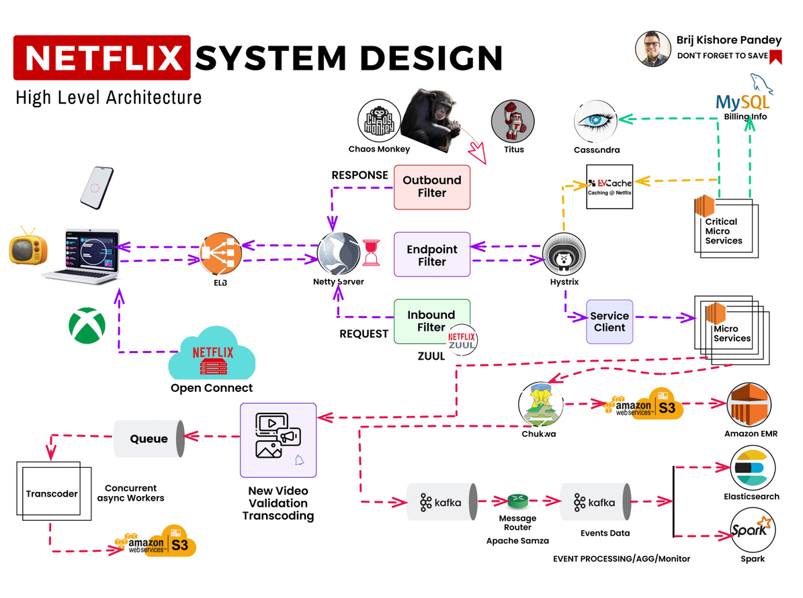

# Case study: Exploring the Technological Marvel Behind Netflix!

Ever wondered about the tech wizardry that powers your binge-watching adventures on Netflix? 🚀 Netflix is the world's leading streaming service, with over 247 million paid subscribers in more than 190 countries¹. To deliver seamless and personalized entertainment experiences to millions of users, Netflix relies on a cutting-edge tech stack that covers various aspects of computing, storage, networking, databases, analytics, application development, security, and more. Here's a sneak peek into the core technologies and frameworks that underpin Netflix's digital empire, and how they work together to create a captivating and reliable streaming service.

📱 **Mobile & Web:** Netflix offers native mobile apps for iOS and Android devices, as well as a unified web experience for desktop and laptop users. The mobile apps are developed using Swift for iOS and Kotlin for Android, two modern and expressive programming languages that offer high performance and readability. The web app is built using React, a versatile and popular JavaScript framework that enables fast and interactive user interfaces.

🌐 **Frontend/Server Communication:** Netflix uses GraphQL, a query language and runtime for APIs, to enhance communication efficiency between frontend and servers. GraphQL allows the frontend to specify the exact data it needs from the server, reducing bandwidth and improving loading times. GraphQL also enables the frontend to fetch data from multiple sources with a single request, simplifying the data fetching logic.

🔨 **Backend Services:** Netflix adopts a microservices architecture, breaking its functionalities into independent and loosely coupled services, each with its own responsibility and domain. This architecture allows Netflix to develop, test, and deploy services rapidly and independently, while improving system resiliency and scalability. Some of the key technologies and frameworks that Netflix uses for its backend services are:

- ZUUL: A gateway service that provides dynamic routing, monitoring, resiliency, and security for the incoming requests.
- Eureka: A service discovery tool that helps the services find and communicate with each other.
- Spring Boot: A framework that simplifies the creation and configuration of Java-based applications.

💾 **Databases:** Netflix uses a variety of data storage solutions to manage enormous databases that contain user profiles, content libraries, and other information. Depending on the data type and use case, Netflix chooses the most suitable database for each service. Some of the databases that Netflix uses are:

- EVCache: A distributed in-memory cache that provides fast and consistent access to frequently used data, such as user preferences and recommendations.
- Cassandra: A distributed NoSQL database that provides high availability and scalability for large volumes of structured and semi-structured data, such as user profiles and viewing histories.
- CockroachDB: A distributed SQL database that provides strong consistency and resilience for transactional data, such as billing and subscriptions.
- S3: A cloud object storage service that provides durability and availability for unstructured data, such as images and videos.

📨 **Messaging/Streaming:** Netflix relies on real-time messaging and streaming technologies to deliver content to users and communicate between services. Some of the technologies that Netflix uses for messaging and streaming are:

- Apache Kafka: A distributed streaming platform that enables high-throughput and low-latency data processing and delivery, such as video streaming and event sourcing.
- Apache Flink: A distributed stream processing framework that enables stateful and complex computations on streaming data, such as personalization and analytics.

🎥 **Video Storage:** Netflix has a vast library of video content, ranging from movies and TV shows to documentaries and originals. To store and deliver this content to users, Netflix uses two main technologies:

- S3: A cloud object storage service that provides durability and availability for unstructured data, such as images and videos. Netflix uses S3 to store the original and encoded versions of its video content, as well as the metadata and subtitles.
- Open Connect: A content delivery network (CDN) that consists of thousands of servers located in internet exchange points (IXPs) around the world. Netflix uses Open Connect to cache and serve its video content to users, reducing latency and bandwidth costs.

📊 **Data Processing:** Netflix generates and collects a massive amount of data from its users and services, such as viewing habits, ratings, feedback, errors, and performance metrics. To process and analyze this data, Netflix uses various technologies and frameworks, such as:

- Flink: A distributed stream processing framework that enables stateful and complex computations on streaming data, such as personalization and analytics.
- Spark: A distributed data processing framework that enables batch and stream processing on large-scale data, such as machine learning and ETL.
- Tableau: A data visualization tool that enables interactive and graphical representation of data, such as dashboards and reports.
- Redshift: A cloud data warehouse that enables fast and scalable analysis of structured and semi-structured data, such as business intelligence and reporting.

🛠️ **CI/CD:** Netflix follows a continuous integration and continuous delivery (CI/CD) approach, which enables frequent and reliable delivery of software updates to users. To support this approach, Netflix uses various tools and practices, such as:

- JIRA: A project management tool that enables tracking and collaboration of software development tasks, such as issues, bugs, and features.
- Confluence: A documentation tool that enables sharing and organization of information, such as requirements, designs, and best practices.
- PagerDuty: An incident response tool that enables alerting and escalation of critical issues, such as outages, errors, and failures.
- Jenkins: A CI tool that enables automation and orchestration of software development processes, such as building, testing, and deploying.
- Gradle: A build tool that enables configuration and execution of software builds, such as dependencies, tasks, and plugins.
- Chaos Monkey: A resiliency tool that randomly terminates instances in production, simulating failures and testing the system's ability to recover.
- Spinnaker: A CD tool that enables automation and orchestration of software delivery processes, such as deployment, rollback, and canary.
- Atlas: A monitoring tool that enables collection and visualization of metrics, such as performance, availability, and utilization..

## Contribution 🛠️
Please create an [Issue](https://github.com/drshahizan/BDM/issues) for any improvements, suggestions or errors in the content.

You can also contact me using [Linkedin](https://www.linkedin.com/in/drshahizan/) for any other queries or feedback.

