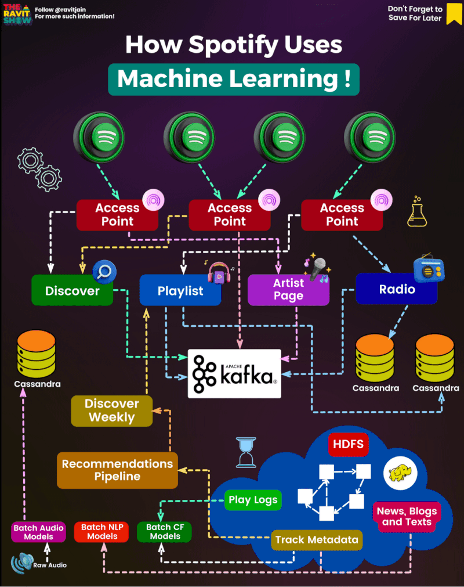

# Case study: 🎶 Unlocking Spotify's Musical Enchantment with Machine Learning

Spotify, the renowned music streaming platform, has seamlessly integrated machine learning into its core operations, creating a highly personalized and enchanting music experience for its users. Through collaborative filtering, Spotify analyzes your music preferences and leverages user data to recommend new songs and playlists that align with your unique taste. Natural Language Processing (NLP) enables Spotify to delve into articles, social media conversations, and online content to better understand artist and song sentiment, thus fine-tuning its recommendations. The platform doesn't stop at its internal data; it taps into external sources to stay current with music charts and trends. Furthermore, Spotify's employment of audio models to categorize songs by genre, tempo, and mood ensures that recommendations resonate with your current vibe while also giving emerging artists their spotlight. Moreover, it leads a blockchain revolution to transform the music industry by ensuring equitable compensation for artists in the streaming age. In sum, Spotify's harmonious blend of machine learning and innovation results in an extraordinary and ever-evolving musical journey for its users. 🎶🤖📻

## Contribution 🛠️
Please create an [Issue](https://github.com/drshahizan/BDM/issues) for any improvements, suggestions or errors in the content.

You can also contact me using [Linkedin](https://www.linkedin.com/in/drshahizan/) for any other queries or feedback.

