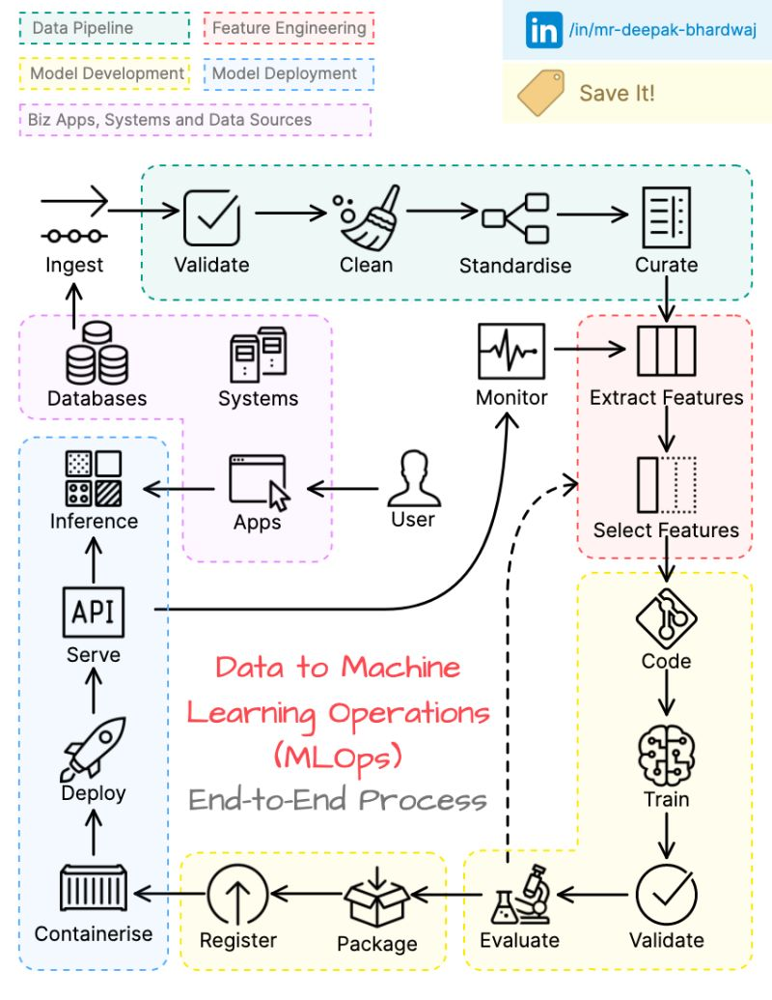

🌟 Hit star button to save this repo in your profile

# The Data to MLOps Journey: An End-to-End Process 🔬

The journey from data to MLOps is a multifaceted process that underpins the development, deployment, and management of machine learning models. Each step in this intricate journey contributes to the robustness and success of your machine learning operations. Let's explore the process in detail:

### 1️⃣ **Ingest Data**: 

**Ingesting data** marks the initiation of the MLOps journey. This step involves capturing raw data from diverse sources, including databases, APIs, and data streams. Ensuring a smooth data ingestion process is vital as it sets the stage for subsequent operations.

### 2️⃣ **Validate Data**: 

Data quality is paramount in MLOps. During **data validation**, you meticulously check data for accuracy, integrity, and consistency. This step involves identifying and addressing issues, such as missing values and outliers, to ensure the reliability of your dataset.

### 3️⃣ **Clean Data**: 

**Data cleansing** is where you roll up your sleeves to eliminate inconsistencies and rectify quality issues. This process involves data wrangling, which includes handling missing values, dealing with duplicate entries, and smoothing out data irregularities.

### 4️⃣ **Standardize Data**: 

In this step, you focus on ensuring data uniformity. **Standardizing data** involves transforming data into a consistent format, making it easier to work with and ensuring seamless processing.

### 5️⃣ **Curate Data**: 

Data organization is at the heart of MLOps. During the **data curation** process, you structure data effectively for feature engineering and model development. This step is pivotal for creating a solid foundation for your machine learning endeavors.

### 6️⃣ **Extract Features**: 

**Feature extraction** is where the magic of insights begins. This process involves digging deep into the data to derive meaningful patterns and insights, often by engineering new features from the existing dataset.

### 7️⃣ **Select Features**: 

Not all features are created equal. During **feature selection**, you identify the most impactful features while discarding irrelevant or redundant ones. This optimization step is crucial for enhancing model efficiency.

### 8️⃣ **Identify Candidate Models**: 

In the realm of MLOps, selecting the right model is pivotal. In the **identification of candidate models**, you explore a variety of machine learning models that are best suited for the specific task at hand. This step is informed by your problem's requirements and data characteristics.

### 9️⃣ **Write Code**: 

Programming is the backbone of MLOps. During **code development**, you implement the logic required for model training, evaluation, and deployment. This technical aspect is central to bringing your machine learning models to life.

### 🔟 **Train Models**: 

**Model training** is the heart of MLOps, where you leverage the curated data and features to train models. The goal is to make your models capable of making accurate predictions and classifications.

### 1️⃣1️⃣ **Validate Models**: 

The performance of your models is assessed during **model validation**. This is a critical phase to ensure that your models meet predefined benchmarks and perform effectively in real-world scenarios.

### 1️⃣2️⃣ **Evaluate Models**: 

During **model evaluation**, you utilize appropriate metrics to gauge your models' performance. This step involves measuring aspects like accuracy, precision, recall, and other relevant indicators.

### 1️⃣3️⃣ **Revisit Candidate Models**: 

Informed by the evaluation results, it's time to **revisit candidate models** and fine-tune them. This step includes adjustments to hyperparameters, data preprocessing, and other aspects to optimize model performance.

### 1️⃣4️⃣ **Select Best Model**: 

Selecting the best model is a key decision. It's here that you determine the highest-performing model that aligns with your business objectives and problem requirements.

### 1️⃣5️⃣ **Package Model**: 

Before deployment, you must **package the model** appropriately, bundling it with all necessary files and dependencies to ensure it functions seamlessly.

### 1️⃣6️⃣ **Register Model**: 

**Model registration** is a critical part of MLOps. It involves maintaining a central repository where deployed models are tracked and managed. This supports version control and facilitates model governance.

### 1️⃣7️⃣ **Containerize Model**: 

For portability and ease of deployment, you can opt to **containerize the model**. Containerization encapsulates the model within a container, making it simple to move between different environments.

### 1️⃣8️⃣ **Deploy Model**: 

The **model deployment** phase is where your model transitions to a production environment, ready for consumption by end-users or other applications. This is a pivotal step in operationalizing your machine learning solutions.

### 1️⃣9️⃣ **Serve Model**: 

Exposing your deployed model through APIs is crucial for seamless integration. During **serving the model**, you ensure that other systems and applications can effectively utilize the model's capabilities.

### 2️⃣0️⃣ **Inference Model**: 

**Model inference** is where the rubber meets the road. This is when you leverage the model for real-time predictions and data-driven decisions.

### 2️⃣1️⃣ **Monitor Model**: 

Once deployed, continuous monitoring is essential. **Model monitoring** involves tracking the performance and behavior of your model in real-world settings.

### 2️⃣2️⃣ **Retrain or Retire Model**: 

Machine learning models are not static; they require periodic evaluation. During **retraining or retiring the model**, you assess its ongoing performance and either update or phase out the model based on its effectiveness.

The data to MLOps journey encompasses an array of interconnected steps that collectively shape the success of your machine learning operations. Each stage is integral, and a misstep at any point can impact the overall effectiveness of your machine learning solutions. 🚀📈🧠

## Contribution 🛠️
Please create an [Issue](https://github.com/drshahizan/BDM/issues) for any improvements, suggestions or errors in the content.

You can also contact me using [Linkedin](https://www.linkedin.com/in/drshahizan/) for any other queries or feedback.

