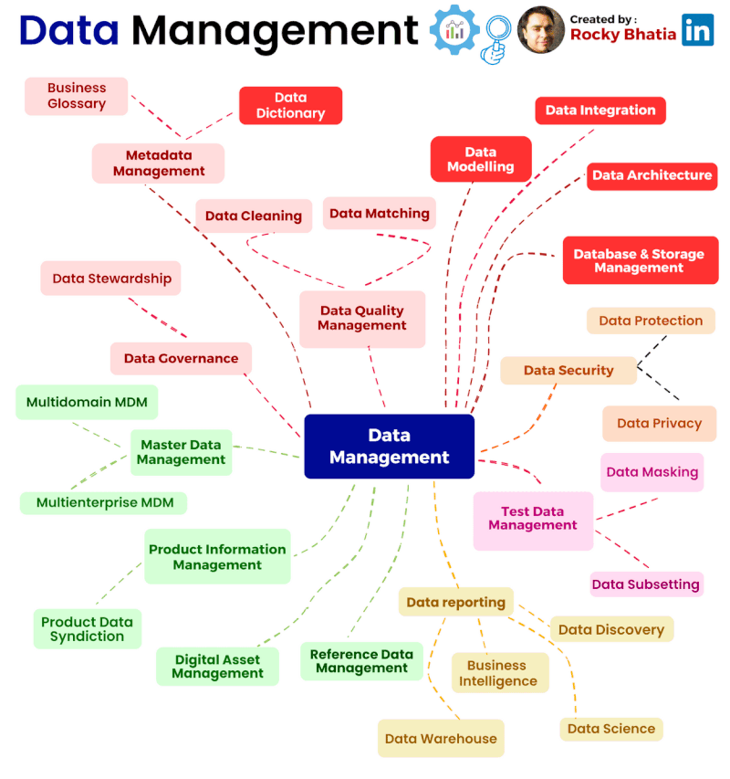

🌟 Hit star button to save this repo in your profile

# Data Management
In today's landscape, data management stands as the foundational pillar of successful business operations. With data at the heart of every decision and innovation, its effective handling, from ensuring its quality and security to establishing comprehensive governance and architecture, has become paramount. As data volumes surge and data-driven insights drive enterprises forward, a holistic and adaptive approach to data management is essential for maintaining accuracy, security, and the agility needed to navigate the complexities of the modern data-driven era.

### **Data Quality** 🧹
Quality is non-negotiable. Garbage in, garbage out. High-quality data is the foundation for meaningful analysis, decision-making, and innovation. Regular data profiling, cleansing, and validation are essential to maintain data accuracy and reliability.

Data quality management involves:

- **Data Profiling**: Understanding the characteristics and patterns within your data to identify anomalies and inconsistencies.

- **Data Cleansing**: Removing or correcting errors and inconsistencies in the data to improve its quality.

- **Data Validation**: Ensuring that data adheres to predefined rules and standards to maintain accuracy and reliability.

### **Data Security** 🔒
With data breaches making headlines, data security is paramount. Implementing encryption, access controls, and security protocols ensures that only authorized personnel can access and manipulate sensitive data, safeguarding both customer trust and regulatory compliance.

Key elements of data security include:

- **Data Encryption**: Protecting data by converting it into a secure code that can only be accessed with the appropriate decryption key.

- **Access Controls**: Managing who has permission to access, modify, or delete data within an organization.

- **Security Protocols**: Implementing standardized procedures and practices to secure data from unauthorized access.

### **Master Data Management (MDM)** 🌐
Enterprises dealing with diverse datasets from various sources benefit from MDM. It provides a unified, consistent view of master data like customer, product, or location information, eliminating redundancy and ensuring data consistency across the organization.

MDM involves:

- **Data Integration**: Combining data from disparate sources into a single, unified view.

- **Data Standardization**: Ensuring that data follows consistent formats and definitions across the organization.

- **Data Governance**: Establishing policies and procedures for managing master data effectively.

### **Testing Data** 🧪
Testing isn't just for software; data requires rigorous testing too. Before making decisions based on data, organizations must ensure the data is accurate and reliable. Data testing involves assessing data quality, integrity, and correctness to prevent flawed insights.

Data testing includes:

- **Data Quality Testing**: Assessing the accuracy and reliability of data through various quality checks.

- **Data Integrity Testing**: Ensuring that data remains intact and unaltered during its lifecycle.

- **Data Correctness Testing**: Verifying that data is free from errors, inconsistencies, and inaccuracies.

### **Data Governance** 📜
Governance establishes the rules and processes for data usage. It defines data ownership, responsibilities, and guidelines for data handling.

Key aspects of data governance include:

- **Data Ownership**: Identifying individuals or teams responsible for data assets.

- **Data Policies**: Establishing rules and guidelines for data access, sharing, and usage.

- **Data Compliance**: Ensuring that data handling aligns with legal and regulatory requirements.

### **Data Architecture** 🏗️
Just as a solid foundation supports a building, a well-designed data architecture supports efficient data management.

Data architecture components include:

- **Data Storage**: Determining where and how data is stored, considering databases, data warehouses, and data lakes.

- **Data Integration**: Connecting and consolidating data from various sources.

- **Data Processing**: Defining how data is processed, transformed, and made available for analysis.

### **Metadata Management** 📄
Metadata provides context to data. Managing metadata—information about data—ensures that data users understand its source, meaning, and relationships.

Metadata management tasks encompass:

- **Metadata Cataloging**: Creating a catalog of all metadata assets, including data dictionaries and data lineage information.

- **Metadata Access and Governance**: Controlling who can access and modify metadata to maintain data understanding and lineage.

- **Metadata Relationships**: Mapping and documenting the relationships between different data assets.

### **Data Reporting** 📈
Data is only valuable when it's transformed into actionable insights. Reporting tools and dashboards visualize data in meaningful ways, enabling stakeholders to make informed decisions swiftly.

Data reporting features:

- **Data Visualization**: Using charts, graphs, and tables to make data more understandable and accessible.

- **Dashboards**: Providing a real-time view of key performance indicators and data insights.

- **Ad Hoc Reporting**: Allowing users to create custom reports and queries based on their specific needs.

📊 There are other aspects related to data management; please refer to the diagram below for more details.

Remember, data management is an ongoing journey. As data volumes and complexity grow, so does the need for an adaptable and robust data management strategy. Stay vigilant, iterate, and continuously improve your data management practices to stay ahead in the data-driven era.

## Contribution 🛠️
Please create an [Issue](https://github.com/drshahizan/BDM/issues) for any improvements, suggestions or errors in the content.

You can also contact me using [Linkedin](https://www.linkedin.com/in/drshahizan/) for any other queries or feedback.

