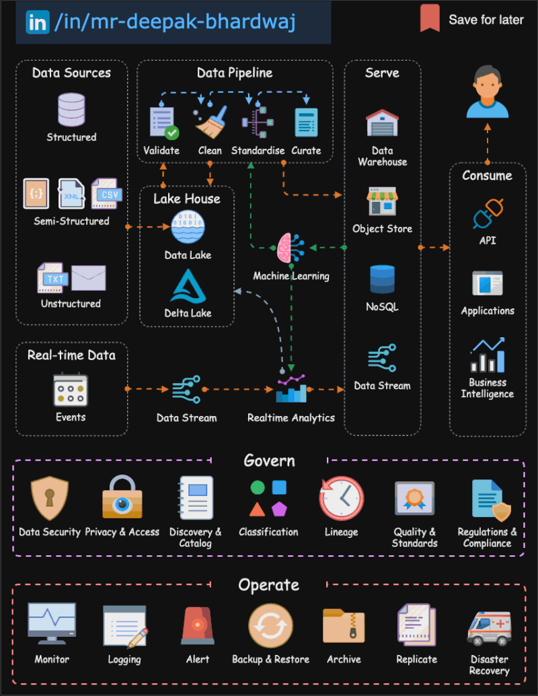

🌟 Hit star button to save this repo in your profile

# Data Platforms Architecture: Governance and Operations

In the realm of data platforms architecture, the success of a comprehensive data ecosystem hinges not only on the selection of the right technologies but also on the rigorous governance and seamless operations that surround it. Let's delve deeper into the vital components that complete the picture of a comprehensive data platform, ensuring it thrives and delivers substantial value:

## 1. Data Governance 📜

**Data governance** forms the bedrock of responsible data management. It's about establishing a robust framework that covers various critical aspects:

- **Data Quality**: Maintaining data accuracy and integrity.
- **Data Security**: Protecting data through encryption and access controls.
- **Compliance**: Ensuring adherence to regulatory requirements.
- **Accountability**: Defining ownership and responsibility for data assets.
- **Access Controls**: Restricting data access based on roles and permissions.
- **Data Classification**: Categorizing data based on its sensitivity.
- **Lifecycle Management**: Managing data from creation to archiving or deletion.

## 2. Data Catalog 📂

A **centralized data catalog** serves as a knowledge repository for your data assets, making them easily discoverable and comprehensible. It facilitates:

- **Data Discovery**: Allowing users to find relevant data quickly.
- **Understanding Data Lineage**: Showing how data is sourced and transformed.
- **Data Definitions**: Providing clear and consistent definitions.
- **Data Relationships**: Highlighting the connections between different datasets.
- **Collaboration**: Fostering a collaborative environment for data users.

## 3. Metadata Management 📝

**Metadata management** is the backbone of data understanding and usage. It involves:

- **Data Discovery**: Using metadata to locate and assess data.
- **Lineage Tracking**: Understanding how data moves and transforms.
- **Impact Analysis**: Recognizing how changes affect downstream processes.
- **Data Documentation**: Providing accurate descriptions for data assets.
- **Facilitating Collaboration**: Enabling data professionals to work efficiently with data.

## 4. Data Security 🔐

**Data security** is paramount in a world where data breaches can be costly and damaging. It encompasses:

- **Encryption**: Protecting data at rest and in transit.
- **Role-Based Access Control**: Allowing the right people to access the right data.
- **Monitoring Mechanisms**: Keeping an eye on data access and usage.
- **Authentication and Authorization**: Ensuring that only authorized users can access data.

## 5. Data Privacy and Compliance 📏

In the era of data privacy regulations, **data privacy and compliance** are non-negotiable. This involves:

- **Anonymization**: Masking or transforming sensitive data to protect privacy.
- **User Consent**: Obtaining clear permission for data usage.
- **Data Subject Rights**: Providing individuals with control over their data.

## 6. Data Monitoring and Auditing 🕵️

Continuous **data monitoring and auditing** are essential for maintaining data platform health. This involves:

- **Usage Monitoring**: Tracking how data is accessed and used.
- **Quality Assessment**: Ensuring data remains accurate and reliable.
- **Performance Monitoring**: Identifying bottlenecks and slowdowns.
- **Issue Identification**: Quickly spotting and addressing data-related problems.

## 7. Disaster Recovery and Business Continuity 🌐

**Disaster recovery and business continuity planning** are essential to prevent data loss and maintain operations in case of unexpected disruptions. This includes:

- **Backup Strategies**: Regularly backing up data to prevent loss.
- **Recovery Plans**: Outlining procedures to restore data and operations.
- **Redundancy**: Implementing failover systems to ensure data availability.

## 8. Performance Optimization 🚀

For a data platform to deliver value, it must be optimized for performance. This involves:

- **Query Optimization**: Fine-tuning database queries for efficiency.
- **Partitioning**: Dividing large datasets into smaller, more manageable parts.
- **Caching**: Storing frequently accessed data for faster retrieval.

## 9. Scalability and Elasticity 📈

With data volumes growing rapidly, a data platform must be designed for **scalability and elasticity**. This includes:

- **Cloud-Based Solutions**: Leveraging cloud services for flexible scaling.
- **Resource Allocation**: Allocating resources as needed to handle increased workloads.

## 10. Continuous Improvement 🔄

Lastly, consider the data platform as a living ecosystem that benefits from ongoing refinement:

- **Regular Evaluations**: Continuously assess the platform's performance and effectiveness.
- **Feedback Loops**: Solicit input from data users to identify areas for improvement.
- **Iterative Enhancements**: Make changes and updates based on feedback and evolving data needs.

By meticulously integrating these Governance and Operating aspects into your data platform architecture, you build a robust foundation for unlocking the true potential of your data. With well-governed data products and a secure, optimized data environment, organizations can make informed decisions, streamline operations, and drive innovation for sustainable growth. 💡📈🚀

## Contribution 🛠️
Please create an [Issue](https://github.com/drshahizan/BDM/issues) for any improvements, suggestions or errors in the content.

You can also contact me using [Linkedin](https://www.linkedin.com/in/drshahizan/) for any other queries or feedback.

