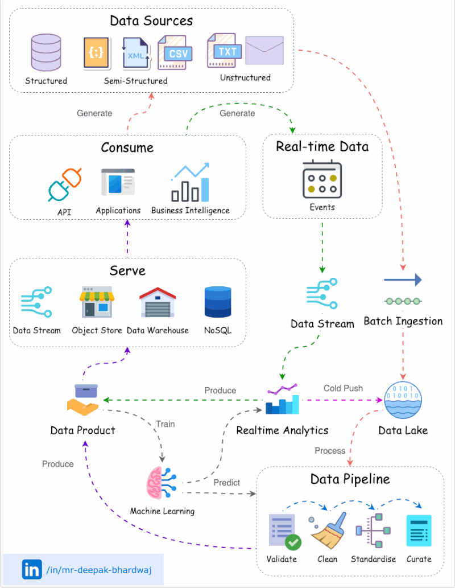
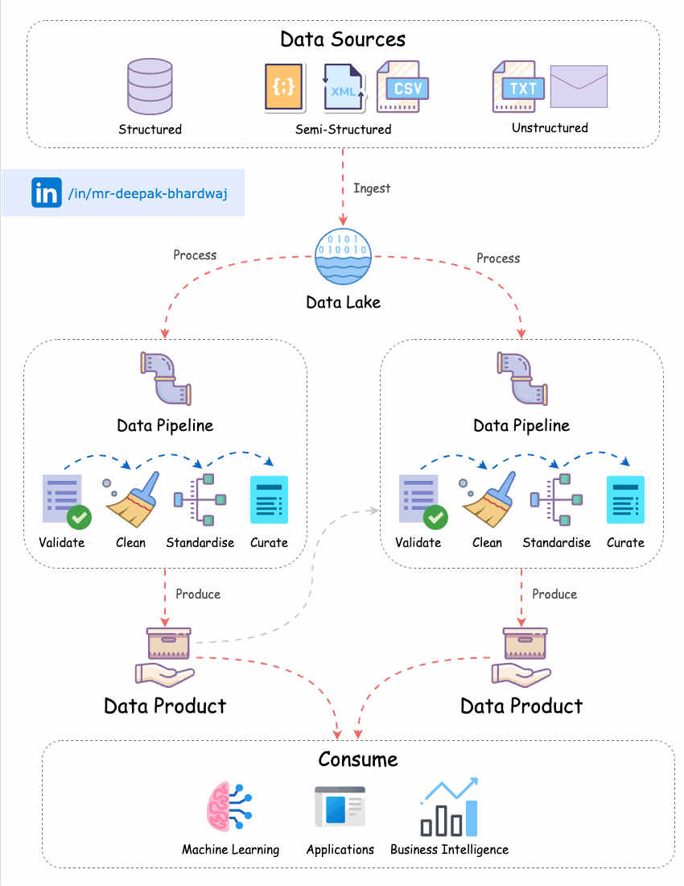

🌟 Hit star button to save this repo in your profile

# Creating Data Products to Monetize Data

In today's data-driven landscape, the art of creating data products serves as a strategic cornerstone for organizations seeking to unlock the true value of their data assets. This comprehensive guide delves deeper into the critical steps and principles involved in crafting data products, offering a detailed roadmap to harness the power of both batch and real-time insights, and subsequently monetize your data.

## 1️⃣ **Data Lake Foundation** 🏞️

Establishing a **Data Lake** is the pivotal first step in the journey of data product creation. This expansive repository acts as a centralized hub, harmonizing data from diverse sources. It offers unified access and lays the crucial groundwork for subsequent data processing.

## 2️⃣ **Batch Data Ingestion for Historical Insights** 📦

The ingestion of batch data into the Data Lake is a foundational process. It empowers organizations to capture and store substantial volumes of data for in-depth analysis. This historical perspective equips businesses with a comprehensive understanding of past trends and patterns, serving as a valuable resource for strategic decision-making.

## 3️⃣ **Real-time Streaming for Immediate Insights** 🚀

Incorporating real-time data streaming through a data/event stream infrastructure ensures that data is captured and processed as events unfold. This capability facilitates swift decision-making and allows organizations to respond immediately to critical events, ultimately enhancing their operational agility.

## 4️⃣ **Lambda Architecture for Hybrid Processing** ⚙️

The integration of the **lambda architecture** offers a balanced approach. It enables the simultaneous processing of real-time events for immediate insights while also directing data for later, more comprehensive analysis. This hybrid strategy is instrumental in maintaining a dynamic equilibrium between real-time decision support and thorough data processing.

## 5️⃣ **Automated Data Pipelines for Accuracy and Efficiency** 🛠️

To ensure data accuracy and efficiency, the implementation of automated data pipelines is paramount. These pipelines are responsible for the extraction, transformation, and loading (ETL) of data from the Data Lake. They operate without delay, guaranteeing the reliability of the data and the smooth flow of data processing.

## 6️⃣ **Data Transformation for Curated Products** 🛒

Following data processing, the transformed data is crafted into curated products. This transformation phase focuses on organizing, structuring, and enriching the data to maximize its value and relevance. These curated products serve as the cornerstone for data-driven insights and decision-making.

## 7️⃣ **Efficient Data Delivery with Purpose-fit Technology** 📦💻

To efficiently serve data products to a diverse array of consumers, including applications, APIs, and business intelligence systems, it is essential to employ purpose-fit technology. This encompasses the use of data warehousing, NoSQL databases, data streams, and object storage, ensuring seamless data delivery and accessibility.

## 8️⃣ **Unlocking the Power of Data Products** 🔐📈

The ultimate value of data products is unlocked when stakeholders, including decision-makers, analysts, and data scientists, consume and leverage them. By doing so, organizations can steer strategic decision-making, harness the predictive capabilities of data products, and deliver personalized experiences. The result is an enhancement of operational efficiency, revenue growth, and an enduring competitive advantage.

## 🔑 Key Benefits of Data Products 💰📈

- ✅ **Monetize Your Data**: Discover new business opportunities and revenue streams by capitalizing on the potential of your data assets with next-generation solutions.

- ✅ **Informed Decision-Making**: Enable data-driven decision-making by providing curated data products that offer valuable insights, thus enhancing efficiency and productivity.

- ✅ **Stay Ahead of the Competition**: Gain a competitive edge by identifying emerging trends, understanding customer preferences, and spotting market opportunities.

- ✅ **Personalized Experiences**: Tailor experiences to meet the unique needs of individual customers by utilizing insights derived from data products.

- ✅ **Operational Efficiency**: Maximize operational efficiency, reduce costs, and optimize processes by harnessing the power of data products.

Creating data products is a strategic imperative in the age of data, offering organizations the means to capitalize on their data assets, achieve business goals, and maintain a competitive edge in their respective industries. 🌐📊🚀

## Contribution 🛠️
Please create an [Issue](https://github.com/drshahizan/BDM/issues) for any improvements, suggestions or errors in the content.

You can also contact me using [Linkedin](https://www.linkedin.com/in/drshahizan/) for any other queries or feedback.

