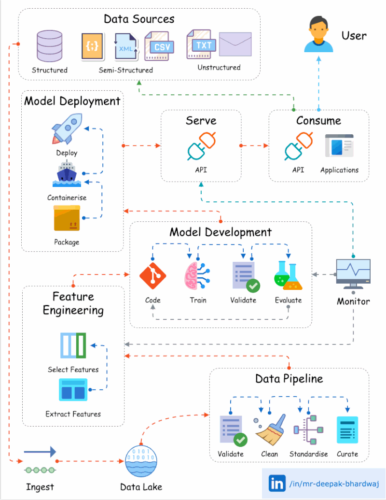

🌟 Hit star button to save this repo in your profile

# 🚀 Revolutionizing Data and Machine Learning with DataOps and MLOps

In the dynamic landscape of data and machine learning, the integration of DataOps and MLOps practices is a transformative force. These methodologies streamline the complex data lifecycle and the intricate journey of machine learning model development, setting a new standard for efficiency, reliability, and success. Let's explore each of the key pillars of MLOps in more detail to gain a deeper understanding of their significance.

## **1. Data Ingestion** 📥

At the foundation of this transformation is **data ingestion**. This crucial step involves sourcing raw data from diverse channels, such as databases, APIs, and external sources. A well-executed data ingestion process ensures that the data is collected efficiently and in a format that is ready for further processing.

## **2. Data Validation** 🧾

Data quality is paramount, and that's where **data validation** comes into play. Rigorous checks are performed to verify the consistency, accuracy, and integrity of the data. This step guarantees that the data is reliable and suitable for downstream operations.

## **3. Data Cleansing** 🛁

Addressing and rectifying data anomalies and quality issues is the essence of **data cleansing**. This step involves cleaning and transforming the data to remove inconsistencies, errors, and outliers, ensuring that it's in the best possible condition for analysis and modeling.

## **4. Data Standardization** 📊

To facilitate hassle-free processing and analytics, **data standardization** is essential. It involves normalizing data formats, units, and structures to create a consistent and coherent dataset. This uniformity simplifies data manipulation and enhances its usability.

## **5. Data Curation** 📋

**Data curation** is all about preparing the data for optimal feature engineering and model formulation. It includes tasks like data preprocessing, feature selection, and data transformation, ensuring that the data is well-prepared for model development.

## **6. Feature Extraction** 🌟

**Feature extraction** is a critical part of creating effective machine learning models. It involves diving deep into the data to identify meaningful insights and patterns that can be used as features for the models. Proper feature extraction can significantly impact model performance.

## **7. Model Training** 🎓

With curated data in hand, **model training** takes the spotlight. During this phase, machine learning models are trained on the data to learn patterns and relationships. The goal is to create models that can make accurate predictions or classifications.

## **8. Model Validation** 📏

**Model validation** ensures that the trained models meet predefined benchmarks and performance standards. This step involves evaluating the model's accuracy, precision, recall, and other relevant metrics to ensure it meets the desired criteria.

## **9. Model Assessment** 📈

**Model assessment** involves a comprehensive evaluation of model efficacy. It includes analyzing the model's performance on test data and understanding how well it generalizes to new, unseen data. This step is vital for making informed decisions based on model predictions.

## **10. Top Model Selection** 🏆

Identifying the **top model** is a crucial business decision. It involves selecting the machine learning model that aligns most closely with the organization's goals and objectives. This decision impacts the model's deployment and the business impact it can make.

## **11. Model Packaging** 📦

Preparing for deployment involves **model packaging**. This step includes bundling all necessary files, dependencies, and resources to ensure that the model can be easily and reliably deployed in various environments.

## **12. Model Registry** 📂

Centralized model tracking and management are achieved through the **model registry**. It provides a structured and organized repository for models, allowing for version control, tracking changes, and facilitating collaboration among data and machine learning teams.

## **13. Model Deployment** 🚀

The transition from development to implementation is marked by **model deployment**. This phase involves making the model available for use in real-world applications, where it can make a significant impact on business operations and decision-making.

## **14. Model Inference** 🔍

**Model inference** allows organizations to tap into real-time predictions generated by deployed models. This is where the insights and patterns identified during feature extraction and model training are put into practical use to steer data-driven strategies and decision-making.

## **15. Model Monitoring** 📡

Continuous vigilance is essential, and that's the role of **model monitoring**. It involves real-time tracking of model performance, detecting anomalies, and ensuring that the model continues to operate effectively and within established thresholds.

By meticulously implementing these pillars of MLOps, organizations can leverage the power of data and machine learning with unprecedented efficiency, reliability, and impact. This transformative approach empowers data-driven decision-making, operational optimization, and innovation for sustainable growth and success. 🌐📊🧠
## Contribution 🛠️
Please create an [Issue](https://github.com/drshahizan/BDM/issues) for any improvements, suggestions or errors in the content.

You can also contact me using [Linkedin](https://www.linkedin.com/in/drshahizan/) for any other queries or feedback.

