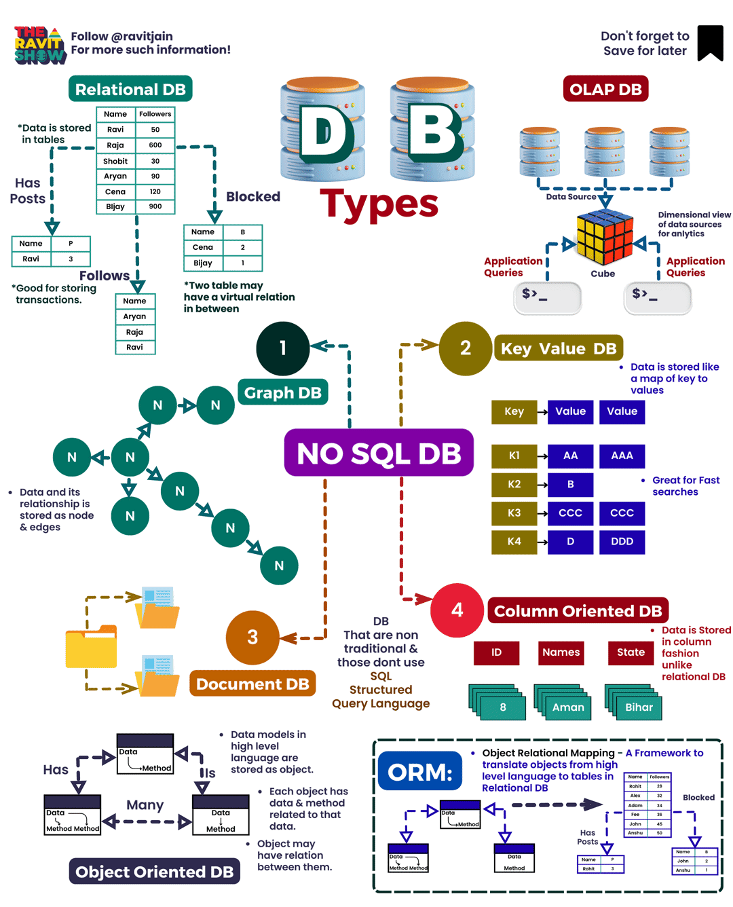

<a href="https://github.com/drshahizan/BDM/stargazers"></a>
<a href="https://github.com/drshahizan/BDM/network/members"></a>
<a href="https://github.com/drshahizan/BDM/pulls"></a>
<a href="https://github.com/drshahizan/BDM"></a>
<a href="https://github.com/drshahizan/BDM/graphs/contributors"></a>


🌟 Hit star button to save this repo in your profile

# Database Types

Databases are the backbone of our digital world, storing and organizing data for easy access and utilization. There are several types of databases, each with unique strengths and weaknesses. Here's an overview of some common database types along with sample SQL syntax for each:

<p align="center">

</p>

1. **Graph Databases**
    - *Use Case:* Ideal for storing data with complex relationships, such as social networks.
    - *Example:* A social media platform uses a graph database to represent connections between users, posts, and comments.
    - *SQL Syntax (Cypher Query Language):*
      Graph databases typically use a query language like **Cypher**. In Cypher, you can perform operations like creating nodes and relationships, filtering data based on patterns, and aggregating results. An example query in Cypher might look like:

    
        ```sql
        MATCH (user:User {name: 'John'})-[:FRIENDS_WITH]->(friend)
        RETURN user, friend
        ```

2. **Relational Databases**
    - *Use Case:* Commonly used for storing structured data, like customer records.
    - *Example:* An e-commerce website uses a relational database to store product information, customer details, and order history.
    - *SQL Syntax (Standard SQL):*
      Relational databases use **SQL (Structured Query Language)**. SQL allows you to create, retrieve, update, and delete data in a structured manner. For instance, to retrieve all customer records in a hypothetical "Customers" table, you might use SQL like:

        ```sql
        SELECT * FROM Customers;
        ```

3. **OLAP Databases (Online Analytical Processing)**
    - *Use Case:* Suitable for analyzing large volumes of data.
    - *Example:* A business intelligence platform employs an OLAP database to generate complex reports and perform data analysis on sales trends.
    - *SQL Syntax (Standard SQL):*
    OLAP databases often use SQL for querying multidimensional data. SQL queries can be complex, involving aggregations and slicing and dicing data. An example SQL query might be:

        ```sql
        SELECT Date, SUM(Sales) FROM SalesData
        GROUP BY Date;
        ```

4. **Document Databases**
    - *Use Case:* Best for storing unstructured data, such as web pages, documents, or JSON objects.
    - *Example:* A content management system uses a document database to manage articles, images, and multimedia content.
    - *SQL Syntax (MongoDB as an example):*
    Document databases often use their query languages or extensions of SQL. In MongoDB, for example, you can query documents using a syntax similar to this:

        ```sql
        db.collection.find({ type: "article" });
        ```

5. **Column-Oriented Databases**
    - *Use Case:* Efficient for storing data frequently queried by column.
    - *Example:* A data warehouse uses a column-oriented database to analyze large datasets, focusing on specific attributes like sales figures or timestamps.
    - *SQL Syntax (Standard SQL):*
    Column-oriented databases also use SQL for querying. The SQL queries focus on selecting specific columns for analysis. An example query might be:

        ```sql
        SELECT Sales, Date FROM SalesData
        WHERE Date BETWEEN '2023-01-01' AND '2023-12-31';
        ```

6. **Key-Value Databases**
    - *Use Case:* Suitable for storing data accessed by a unique key.
    - *Example:* A caching system relies on a key-value database to quickly retrieve frequently used data, like session information for web users.
    - *SQL Syntax (Pseudo-SQL):*
    Key-value databases typically have simple CRUD (Create, Read, Update, Delete) operations based on keys. For example:
        ```sql
        INSERT INTO Cache (key, value) VALUES ('session123', 'user_data');
        ```

7. **ORM Frameworks (Object-Relational Mapping)**
    - *Use Case:* These frameworks provide an abstraction layer between code and databases, simplifying database operations.
    - *Example:* A web application employs an ORM framework to interact with a relational database, allowing developers to work with Python or Java objects rather than writing raw SQL queries.
    - *Sample ORM Code (Django ORM as an example):*
    ORM frameworks abstract SQL queries, so you interact with databases using your programming language (e.g., Python or Java) rather than writing SQL directly. For example, in Django's ORM (Python), you can retrieve all objects from a model like this:

        ```python
        users = User.objects.all()
        ```

> Please note that the SQL syntax can vary slightly depending on the specific database management system you're using (e.g., MySQL, PostgreSQL, MongoDB, Neo4j), so it's essential to consult the documentation of the database you're working with for precise syntax and features.

Each database type has its strengths and is suited for specific use cases. The database landscape continues to evolve to meet the diverse needs of modern applications, making it essential to choose the right database type for a particular project.

## Contribution 🛠️
Please create an [Issue](https://github.com/drshahizan/BDM/issues) for any improvements, suggestions or errors in the content.

You can also contact me using [Linkedin](https://www.linkedin.com/in/drshahizan/) for any other queries or feedback.

[](https://visitorbadge.io/status?path=https%3A%2F%2Fgithub.com%2Fdrshahizan)


