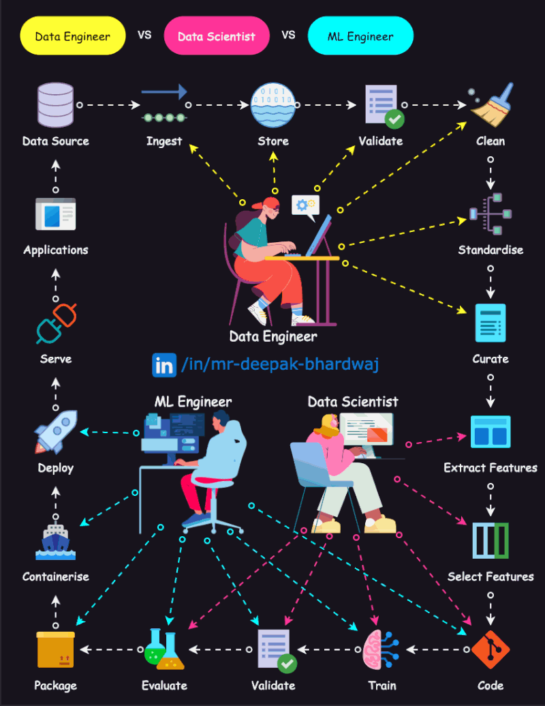

🌟 Hit star button to save this repo in your profile

# Charting Your Path in Data and Machine Learning 🚀

Are you embarking on a journey into the exciting world of Data and Machine Learning (ML)? It's essential to understand where you fit in and what skills to acquire. Here's an in-depth guide to critical roles and their associated responsibilities in this dynamic domain:

## 🔘 **Data Engineer: Ideal for Data Enthusiasts** 

**Data Engineers** are the architects of data pipelines, responsible for making data available and accessible. Their journey involves:

1. **Learn Data Ingestion**: Acquiring the essential skills to collect and bring data into the organization. This includes understanding data sources, integration methods, and ensuring data reliability.

2. **Data Validation**: Becoming experts in data quality checks, verifying the consistency, accuracy, and integrity of data. This is critical to ensure that data is reliable for further processing.

3. **Data Cleansing**: Exploring techniques for data cleaning, a crucial step to rectify anomalies, errors, and ensure data quality. This process involves handling missing data, outliers, and inconsistencies.

4. **Standardize Data**: Mastering data formatting rules to ensure uniformity in data structure. This includes dealing with data in different formats, units, or schemas.

5. **Curate Data**: Organizing and managing data efficiently, making it ready for analysis and modeling. Data curation involves creating clean, well-structured datasets that can be used for various purposes.

## 🔘 **Data Scientist: Perfect for Analytical Minds**

**Data Scientists** are the data storytellers, interpreting data and extracting insights. Their journey includes:

6. **Extract Features**: Learning how to identify patterns and meaningful insights within data. This step is crucial for creating features that can be used to build machine learning models.

7. **Select Features**: Mastering the art of feature selection, where you choose the most relevant features to improve the efficiency and performance of machine learning models.

8. **Identify Candidate Models**: Exploring various model selection techniques to determine the most suitable algorithms and approaches for solving specific problems.

## 🔘 **Data Scientist & ML Engineer: For Coding Enthusiasts**

**Data Scientists & ML Engineers** bridge the gap between data science and engineering, combining coding skills with analytics. Their journey involves:

9. **Write Code**: Developing strong programming skills to craft efficient data analysis, data processing, and machine learning solutions.

10. **Train Models**: Understanding the intricacies of model training processes, where machine learning models are "taught" to make predictions or classifications based on data.

11. **Validate Models**: Mastering validation techniques to ensure that machine learning models perform as expected, with a focus on accuracy, precision, and other relevant metrics.

12. **Evaluate Models**: Becoming proficient in using evaluation metrics to assess model performance. This step involves understanding how well the model generalizes to new, unseen data.

13. **Revisit Candidate Models**: Grasping the art of model refinement, where you fine-tune models to improve their performance and address issues.

14. **Select the Best Model**: Learning to choose the most suitable machine learning model for specific problems, aligning with business goals and objectives.

## 🔘 **ML Engineer: Deployment Enthusiasts**

**ML Engineers** focus on taking machine learning models from development to deployment. Their journey comprises:

15. **Package Model**: Acquiring knowledge of essential packaging techniques to prepare machine learning models for deployment. This includes bundling model files and dependencies.

16. **Register Model**: Mastering model tracking and version control, ensuring that different model versions can be managed effectively.

17. **Containerize Model**: Understanding the intricacies of containerization, where models are encapsulated within containers for streamlined and scalable deployment.

18. **Deploy Model**: Becoming proficient in deploying machine learning models effectively in real-world applications, making them ready for use by end-users.

These roles represent different facets of the Data and ML landscape, catering to a wide array of interests and skill sets. As you explore these domains, consider your passion and strengths to tailor your learning path accordingly. The world of Data and ML welcomes your unique expertise and dedication. 🌐📊👩‍💻
## Contribution 🛠️
Please create an [Issue](https://github.com/drshahizan/BDM/issues) for any improvements, suggestions or errors in the content.

You can also contact me using [Linkedin](https://www.linkedin.com/in/drshahizan/) for any other queries or feedback.

