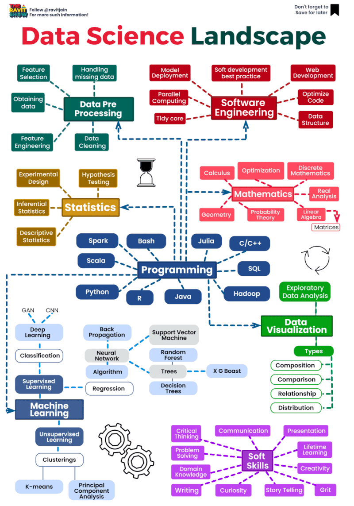

🌟 Hit star button to save this repo in your profile

# Navigating the Data Science Landscape 🌐

The data science landscape refers to the broad and evolving field of data science, which encompasses various aspects related to the collection, processing, analysis, and interpretation of data. This landscape includes the methodologies, techniques, tools, and technologies employed by data scientists to extract meaningful insights, patterns, and knowledge from data. Data science is a multidisciplinary field that integrates elements of computer science, statistics, mathematics, domain expertise, and data engineering. It is a dynamic landscape characterized by continuous innovation, with emerging trends, challenges, and opportunities in areas like machine learning, deep learning, big data, and artificial intelligence. Data scientists navigate this landscape to leverage data for informed decision-making, problem-solving, and predictive analytics across diverse industries and domains.

Data science is a dynamic and multifaceted field that plays a pivotal role in transforming raw data into valuable insights. Let's delve deeper into the key areas of expertise within the data science landscape:

## 1️⃣ **Data Preprocessing** 🧹

**Data preprocessing** is the foundational step in the data science journey. It involves cleaning, transforming, and organizing raw data to make it suitable for analysis. Data scientists identify and handle missing values, outliers, and inconsistencies, ensuring that the dataset is reliable and ready for in-depth exploration.

## 2️⃣ **Software Engineering** 💻

In the realm of data science, **software engineering** skills are essential. Data scientists utilize programming languages such as Python, R, and Java, along with software tools like Jupyter and RStudio, to develop and maintain data science projects. This involves writing efficient code, building data pipelines, and creating robust data-driven applications.

## 3️⃣ **Web Development** 🌐

**Web development** plays a crucial role in data science communication. Data scientists often need to create user-friendly websites or web applications to present their findings and insights. These platforms provide a means to interactively share data visualizations, dashboards, and reports with stakeholders.

## 4️⃣ **Statistics** 📈

Statistics is the mathematical foundation of data science. It encompasses a wide range of techniques for data analysis, hypothesis testing, and predictive modeling. Data scientists use statistical methods to explore data, identify patterns, and draw meaningful conclusions, which form the basis for informed decision-making.

## 5️⃣ **Programming Languages** 🐍

Proficiency in various **programming languages** is a cornerstone of data science. Python is a popular choice due to its versatility and extensive libraries for data manipulation, analysis, and machine learning. R is another language known for its statistical capabilities, while SQL is indispensable for working with databases.

## 6️⃣ **Machine Learning** 🤖

**Machine learning** is at the core of data science. It involves the use of algorithms to analyze data, uncover patterns, and make predictions. Data scientists leverage supervised and unsupervised learning techniques to build models that can be trained on historical data and used to make informed forecasts.

## 7️⃣ **Deep Learning** 🧠

A subset of machine learning, **deep learning** excels in handling complex data, such as images and text. It relies on artificial neural networks to extract high-level features and insights from large datasets. Deep learning is instrumental in tasks like image recognition, natural language processing, and speech analysis.

## 8️⃣ **Soft Skills** 🤝

While technical expertise is crucial, **soft skills** are equally important in the data science landscape. Effective communication is vital for conveying complex findings to non-technical stakeholders. Teamwork facilitates collaboration with colleagues from diverse backgrounds, and problem-solving is essential for tackling real-world challenges.

The data science landscape is an ever-evolving domain where the fusion of technical skills, mathematical acumen, and effective communication converges to unlock the potential of data. Data scientists are not just analysts; they are storytellers, engineers, and problem solvers who empower organizations with actionable insights and data-driven decision-making. 🚀📊💡

## Contribution 🛠️
Please create an [Issue](https://github.com/drshahizan/BDM/issues) for any improvements, suggestions or errors in the content.

You can also contact me using [Linkedin](https://www.linkedin.com/in/drshahizan/) for any other queries or feedback.

