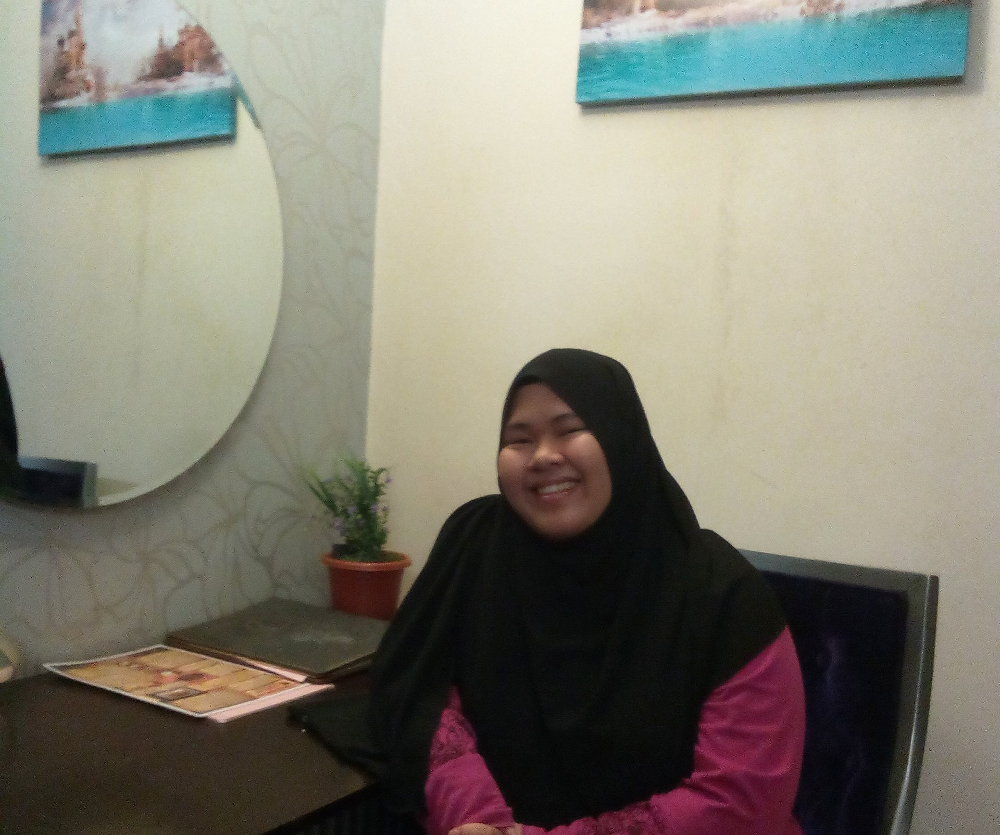

# Nur Azimah MS - Data Science Enthusiast

  

## About Me
I am a full time Master degree student in Data Science field. Dealing with data during my internship make me want to pursue in depth of Data Science. I want to see with my own eyes how Data Science will shape the future through prediction in Data Analysis.

## Education
- **Degree:** Master in Science (Data Science) [ongoing]
  - **Institution:** Universiti Teknologi Malaysia
  
- **Degree:** Bachelor in Computer Science (Software Engineering)
  - **Institution:** Universiti Tun Hussein Onn Malaysia
  - **Graduation Year:** 2022
  

## Interests
- Data Analysis and Visualization
- Machine Learning 
- Python Programming
- Statistical Modeling

## Skills
- SQL
- Phyton
- Machine Learning
- Data Visualization

## Contact

  

